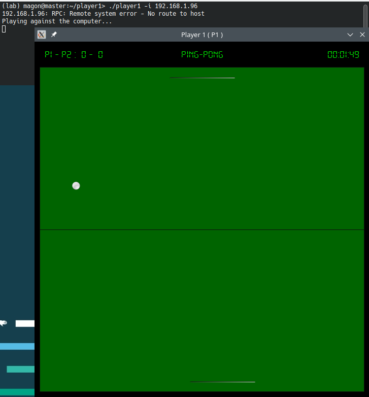

# SDL-PPONG



```shell
~/SDL-PPONG/player1> make prepare
~/SDL-PPONG/player1> make player1
~/SDL-PPONG/player1> ./player1 --help
```

Despite the game purpose is to be played over network, we don't yet test it in two seperated hosts! Instead, we tested it using virtual machines.

Sun RPC use case
================

SunRPC mechanism is used to:

1. Exchange paddle positions between players.
2. Launch the ball by the winner player, at the side of the second player, to start a new round. 

The [player1_rpc.x](https://github.com/MagonBC/SDL-PPONG/blob/main/player1/rpc/player1_rpc.x) and [player2_rpc.x](https://github.com/MagonBC/SDL-PPONG/blob/main/player2/rpc/player2_rpc.x) files
are used to generate client and server stubs for each player:

```shell
~/SDL-PPONG/player1/rpc> rpcgen player1_rpc.x 
~/SDL-PPONG/player1/rpc> ls
player1_rpc_clnt.c  player1_rpc.h  player1_rpc_svc.c  player1_rpc.x
```

You don't need to regenerate stubs.

Nice!
